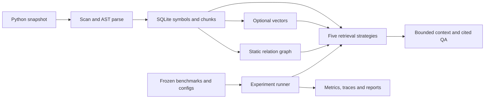

# Structure-Aware Code Retrieval and Evaluation for Repository-Level LLM Applications

A Python research and engineering project asking: **does repository structure help
retrieve the right code for repository-level LLM questions?** It compares BM25,
dense, hybrid, symbol-aware and structure-aware retrieval, with reproducible
evaluation, source traces, cost measurements and a cited QA pipeline.

The system reads local Python snapshots statically. Each query targets one repository.
It does not execute or edit the indexed code. The focus is retrieval and evaluation;
coding-agent loops, model training and distributed serving are outside its scope.

**Latest checkpoint: M7d live — partial judge-only run archived and checked offline.**
All five retrievers, evaluation, QA tooling and CPU Docker delivery are implemented.
The retrieval matrix contains 45 runs on eight snapshots and 170 questions. The
[live QA experiment](reports/m7b-live/README.md) adds 60 real generations and 60
Mini-model judgments: 24 judgments passed validation and 36 failed the frozen
protocol. **Labels remain provisional; limited judge coverage prevents a reliable
QA-quality ranking.** Model assessments are not human review or true accuracy.
The [v2 protocol checkpoint](reports/m7c/README.md) adds exact-answer schemas,
explicit evidence catalogs and offline diagnostics against archived failures.
The [judge-only runtime](reports/m7d/README.md) subsequently ran under a separately
approved US$2.20 budget. The [partial v2 record](reports/m7d-live/README.md) contains
13 journaled attempts: 12 valid judgments, one unknown outcome and 47 requests not
started after a local execution interruption. Its cause was not preserved. The
known new cost subtotal is US$0.08424075; the full cost is unknown. These 12 results
are an ordered Click-only prefix, not a completed 60-request comparison.
See [acceptance status](docs/status.md) and the
[LLM evaluation specification](docs/llm-evaluation.md). Human review is optional.

## What the experiments show

On 120 expanded test-candidate questions from five repositories, the frozen full
Structure heuristic does not improve aggregate quality over Hybrid:

| Strategy | Recall@10 | NDCG@10 |
| --- | ---: | ---: |
| BM25 | 0.6444 | 0.4854 |
| Dense | 0.7292 | 0.5675 |
| Hybrid | 0.7944 | 0.5947 |
| Symbol-aware | 0.7931 | 0.5838 |
| Structure-aware (full) | 0.7917 | 0.5109 |

On the 40 cross-file questions, Structure improves Recall@10 from 0.7083 to 0.7500
while lowering NDCG@10. These are provisional symbol-level, query-macro scores with
sparse judgments. Development and public-adaptation results are reported separately.
Exposed test outcomes must not be reused for tuning a claimed held-out comparison.

Read [results and limitations](RESULTS.md) for all metrics, paired uncertainty,
latency, memory, failure cases and the outstanding research work. The
[generated overview](reports/overview/report.md) validates and summarizes all 45
saved runs without loading a model or rerunning retrieval.

On 12 QA development questions across five strategies, the generator returned 48
answers and 12 abstentions. Answer citation IDs passed all 48 applicable checks,
but only 40% of judge outputs passed the semantic assessment protocol. Reported
tokens imply **US$0.490214 at frozen uncached rates**, not an invoice. The
[QA failure analysis and raw archive](reports/m7b-live/README.md) explain the
evidence-ID/status failures and preserve them without repair or retries.

## Quickstart

Install Git and [uv](https://docs.astral.sh/uv/getting-started/installation/), then
run these commands in PowerShell or a POSIX shell:

```text
git clone https://github.com/Shenggyyy/structure-aware-code-retrieval.git
cd structure-aware-code-retrieval
uv sync --locked --dev
uv run --locked sacr --help
uv run --locked sacr index tests/fixtures/sample_repo --output artifacts/sample.sqlite
uv run --locked sacr search "calculate_checksum" --index artifacts/sample.sqlite --top-k 3
uv run --locked sacr ask "How is calculate_checksum implemented?" --index artifacts/sample.sqlite --output artifacts/qa/sample-preview
```

Python **3.12** is selected by `.python-version`; uv installs it if necessary. Initial
dependency installation needs network access. The fixture commands need no model,
API key, GPU or Docker. Source is only parsed; QA defaults to an evidence preview
and makes no API call. Search returns paths, one-based inclusive line ranges and
stored code chunks. Use `--json` for full text, identifiers and score components.

Indexes are snapshots: refresh with an explicit `index --overwrite` and rebuild
dependent vectors/graphs. Experiments and QA bundles require new output paths.

Run the complete offline delivery smoke, or verify the published retrieval overview:

```text
uv run --locked python scripts/smoke.py --output artifacts/smoke-host-001
uv run --locked python scripts/summarize_results.py --output reports/overview --check
```

The smoke creates an isolated Git fixture and checks indexing, graph retrieval,
QA preview, evaluation repeatability and review preparation. It measures software
behavior on synthetic data, not real retrieval or answer quality.

## Reproduce and explore

| Task | Guide |
| --- | --- |
| Index your repository and compare five strategies | [Commands and preparation](docs/reproduction.md) |
| Inspect model, tokenization and fusion settings | [Baseline definitions](docs/baselines.md) |
| Understand typed edges, expansion and ablations | [Structure retrieval](docs/structure.md) |
| Rebuild the eight-repository, 45-run experiment | [Frozen matrix and measurement protocol](docs/experiments.md#reproduction) |
| Understand labels, splits, metrics and attribution | [Benchmarks](docs/benchmarks.md), [evaluation](docs/evaluation.md) |
| Inspect optional manual relevance-review tools | [Review workflow](docs/review.md) |
| Prepare QA requests and inspect automatic citation checks | [QA setup and evaluation](docs/qa.md) |
| Inspect real LLM assessments, failures and costs | [Live QA evidence](reports/m7b-live/README.md), [scoring specification](docs/llm-evaluation.md) |
| Prepare and verify the revised judge protocol offline | [M7c checkpoint](reports/m7c/README.md), [commands](docs/reproduction.md#prepare-judge-protocol-v2-from-saved-answers) |
| Reassess saved answers after approval and verify the run offline | [M7d checkpoint](reports/m7d/README.md), [judge-only workflow](docs/qa.md#judge-only-v2-execution) |
| Inspect the partial real v2 run and its unknown outcome | [Partial v2 evidence](reports/m7d-live/README.md), [offline archive check](docs/reproduction.md#verify-the-partial-live-v2-archive) |

Dense retrieval uses optional CPU Sentence Transformers dependencies and a pinned
`all-MiniLM-L6-v2` model. Explicit source/model preparation may download inputs;
retrieval and evaluation read prepared local artifacts. SQLite, NPZ vectors and JSON
graphs require no external database service. Exact vector search and BM25 score the
full corpus; bounded graph expansion does not make that search sublinear.

QA packs canonical source evidence under a **16,000 UTF-8 byte** default limit and
requires supplied source IDs for answer claims. Generating answers requires explicit
`--execute`, a model and local `OPENAI_API_KEY`; see the QA guide before execution.
The 12-case, five-strategy experiment has [saved live responses and judgments](reports/m7b-live/README.md).
Valid citation identifiers alone do not establish correctness or source support.
M7b implements separate generation and judging stages. Prepare and check their common
references, frozen settings and combined estimate offline using the
[QA workflow](docs/qa.md). Both proposed models and the combined budget require explicit
owner approval before any additional API calls. Saved results can be verified offline.
The combined runner remains on rubric v1. M7c prepares v2 requests from saved answers;
M7d adds judge-only execution with explicit model, plan and budget approval. It reuses
the original answers and makes no generation calls. The approved v2 run stopped after
13 attempts; its partial results do not establish reliable judge coverage or better
answer quality. Unknown outcomes are retained without automatic retry or resume.

## Docker

With Docker running in Linux-container mode:

```text
docker build --target base -t sacr:base .
docker run --rm --network none sacr:base --help
docker volume create sacr-artifacts
docker run --rm --network none --mount type=volume,src=sacr-artifacts,dst=/app/artifacts --entrypoint python sacr:base scripts/smoke.py --output artifacts/smoke-001
```

The runtime runs as UID/GID 10001. The optional `dense` target adds CPU embedding
dependencies; prepare model weights separately. After building, the base smoke needs
no network or credentials. See [container reproduction](docs/docker.md) and
[recorded host/container validation](reports/m8a/README.md).

## Architecture and repository layout



```text
src/structure_aware_retrieval/  Parser, indexes, retrievers, evaluation/ and qa/
tests/                        Offline unit/integration tests and small fixtures
benchmarks/                   Versioned manifests, questions, judgments, provenance
configs/                      Fixed strategy, ablation and QA configurations
scripts/                      Experiment runners, smoke and saved-results overview
reports/                      Recorded evidence; overview/ is generated
docs/                         Architecture, protocols, reproduction and acceptance
artifacts/                    Ignored local snapshots, indexes, models and outputs
Dockerfile                    Base and optional CPU Dense runtime targets
.github/workflows/ci.yml       Windows/Linux checks and Linux container smoke
```

The [architecture document](docs/architecture.md) explains source identity, shared
retrieval contracts and evaluation boundaries. Historical reports retain their
original checkpoint status; [current status](docs/status.md) tracks later progress.

## Development and contribution

```text
uv run --locked ruff check .
uv run --locked ruff format --check .
uv run --locked pytest --cov --cov-report=term-missing
uv run --locked python scripts/summarize_results.py --output reports/overview --check
uv build
```

Use four-space indentation, type annotations and Ruff's 100-character line limit.
Name modules/functions in `snake_case`, classes in `PascalCase`, and tests `test_*.py`.
Run `uv run --locked ruff format .` to format. Retain optional dependencies with
`--extra dense` on uv commands when developing with the model. Tests run offline
after installation; coverage is reported without a percentage gate. CI also builds
both CPU container targets and runs their smoke checks with networking disabled.

Keep source, tests and protocol documentation aligned; commit `uv.lock` with dependency
changes. Store downloaded inputs and intermediate outputs under ignored `artifacts/`;
keep credentials out of Git. Preserve recorded experiments when publishing new runs.
Use focused commits with imperative messages, such as `Add saved-result overview validation`.
PRs should explain the behavior change, validation and any effect on experimental
comparability. Follow the [milestone workflow](docs/roadmap.md): the owner reviews,
commits and pushes each completed checkpoint.
