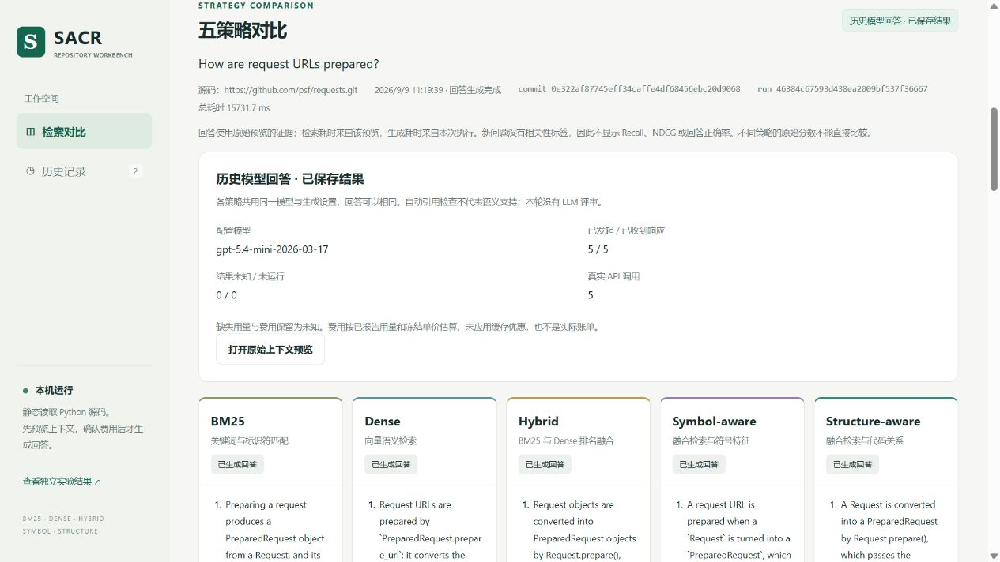

[English](README.md) | [简体中文](README.zh-CN.md)

# Structure-Aware Code Retrieval and Evaluation for Repository-Level LLM Applications

**代码仓库的结构信息，能否帮助 LLM 为用户问题找到更相关的代码？**
本项目面向 CS / AI Systems，以 Python 仓库为研究对象，对比 BM25、Dense、Hybrid、
Symbol-aware 和 Structure-aware 五种检索策略，并使用检索证据生成带引用的仓库问答。
项目同时提供本地浏览器工作台、可复现的评估实验和可重新查看的历史结果。

核心系统、实验流程和 M9 浏览器工作流已实现并完成验证。目前正在进行最终交付整理：
先完善仓库中英文首页，再完成界面翻译与最终审查。进度见[项目状态](docs/status.md)和
[交付记录](docs/delivery.md)。当前浏览器界面为中文，英文界面属于下一交付阶段。

## 可以做什么

- 导入公开 HTTPS Git 仓库或本地 Python 目录，记录源码版本，准备可复用的索引、向量和静态关系图。
- 对同一个问题，在统一设置下比较五种检索策略，查看代码排名、文件路径、行号、分数和结构关系来源。
- 无需模型 API 即可预览检索上下文；也可以明确批准统一的回答模型和预算，分别根据五种上下文生成回答。
- 比较引用、耗时、模型返回的 token 用量和费用估算；重新打开历史记录无需重复检索或生成。
- 使用版本固定的 benchmark、配置和离线校验，复现实验中的 Recall@K、Precision@K、MRR、NDCG、耗时与结构消融结果。

## 界面展示



这是[已归档 Requests 问答](reports/m9c-live/README.md)的实际浏览器画面，展示的是已保存结果，
不代表本轮新生成，也不是正确率评分。问题和模型回答保留原文。点击证据可以查看保存的源码与行号；
较窄的屏幕可以横向滚动查看五列结果。

## 启动工作台

安装 Git 和 [uv](https://docs.astral.sh/uv/getting-started/installation/)，然后使用 PowerShell
执行以下命令。项目通过 `.python-version` 指定 Python 3.12，uv 可以自动安装对应版本。

```powershell
git clone https://github.com/Shenggyyy/structure-aware-code-retrieval.git
cd structure-aware-code-retrieval
uv sync --locked --dev --extra dense
uv run --locked --extra dense sacr prepare-model --cache artifacts/models
uv run --locked --extra dense sacr workbench serve --workspace artifacts/workbench --model-cache artifacts/models --port 8765
```

首次安装依赖、下载模型以及导入公开仓库需要联网。上下文预览使用本地 CPU 模型权重，无需 API key 或 GPU。
保持终端运行，并打开[本地工作台](http://127.0.0.1:8765/)。按 Ctrl+C 停止服务；端口被占用时可修改 `--port`。

1. 输入公开 HTTPS Git URL 或本地目录。远程仓库可在 ref 字段填写完整 commit，以固定可复现的版本；
   填写 `HEAD` 则解析当前版本。本地路径对应运行服务的电脑上的目录。
2. 点击 **导入并准备**，查看源码版本以及解析、向量和关系图的准备状态。项目只静态读取被导入仓库，
   不执行其依赖安装、安装脚本或测试。
3. 输入问题，点击 **运行五策略预览**，比较检索到的代码证据。某个策略失败或缺失时会如实显示，不补造结果。
4. 如需模型回答，先生成费用计划，核对模型、请求上限和合计估算，再明确确认付费生成与预算。
   启动服务前，仅在服务端本机环境变量中配置 `OPENAI_API_KEY`；修改环境变量后需重启服务。
   不要在网页中输入密钥。
5. 点击回答中的引用查看源码，通过 **历史记录** 重新打开保存的对比。重新打开或刷新页面不会重复付费请求。

启动服务、导入仓库、预览上下文、生成费用计划和查看历史都不会调用回答模型。
经批准的真实生成会将问题和选中的代码上下文发送给模型提供方。默认流程不调用 LLM 评审。
请求结果未知时会保留该状态，不自动重试；费用为估算值，并非实际账单。
更多说明见[完整启动与恢复指南](docs/workbench.md)。

## 不安装模型，直接查看历史回答

以下是另一种独立启动方式：在项目根目录使用已发布归档。完成依赖安装后，无需 API key 或 embedding 权重。

```powershell
uv sync --locked --dev
$replay = Join-Path "artifacts" ("workbench-demo-" + [guid]::NewGuid().ToString("N"))
Expand-Archive -LiteralPath reports/m9c-live/run.zip -DestinationPath $replay
uv run --locked --offline sacr workbench serve --workspace "$replay" --port 8765
```

打开本地工作台，在 **历史记录** 中选择 **How are request URLs prepared?**。
页面显示的 API 调用次数属于历史运行，查看归档不会产生新请求。
[归档指南](reports/m9c-live/README.md#portable-offline-replay)提供完整性校验步骤。
如需不依赖模型的索引、搜索与评估示例，可使用[离线演示](docs/demo.md)。

## 实验说明了什么

| 实验依据 | 结果与解释 |
| --- | --- |
| [检索结果](RESULTS.md) | 在八个仓库快照、170 个问题上完成 45 次运行。在扩展候选集的测试中，完整 Structure 策略的整体质量没有优于 Hybrid；跨文件召回有所提高，但排序质量下降。 |
| [模型辅助评审](reports/m7e-live/README.md) | 累计 v2 协议在 60 个计划评审项中接受 58 项、拒绝一项，并保留一项历史未知结果。协议接受数量不代表真实正确率。 |
| [浏览器验收](reports/m9c-live/README.md) | 对一个已批准的问题，五种策略均返回真实回答，并检查了引用、用量、历史重开与服务重启。这验证的是工作流程，不是策略排名。 |

详细指标、统计分母、费用、负面结果和不确定性统一保留在上述报告中，避免在首页重复维护。
[自动生成的结果总览](reports/overview/report.md)汇总了已校验的历史运行。

## 适用范围与局限

目前只支持 Python，每个问题对应一个仓库，输入为公开 HTTPS 或本地源码，服务面向单用户并绑定
`127.0.0.1`。项目不包含私有仓库认证、Coding Agent、模型训练或分布式服务。
静态关系采用启发式分析；精确向量搜索和 BM25 仍需对整个语料库计算分数。

相关性标签仍标记为 **provisional（暂定）**。标签稀疏、规模较小且已公开的评估集，以及不完整的语义评分覆盖，
都限制了结论的推广范围。不能根据已公开的测试结果调参后，再将其称为未见过的测试集。
引用 ID、路径和行号的自动检查与模型语义评分是两类不同检查，均不能视为经真人审核的标准答案。
没有相关性标签的交互问题不展示 Recall、NDCG 或正确率。不同策略生成相同回答是有效结果。
人工审核保留为可选扩展。

## 架构与目录

现有流程为：**源码快照 → Python AST → SQLite 索引 / 本地向量 / 静态关系图 → 检索 →
受长度限制的上下文 → 带引用的问答**。评估使用同一套检索接口与冻结的 benchmark。
详细设计见[架构文档](docs/architecture.md)。

```text
src/structure_aware_retrieval/  Parser, indexes, retrieval, evaluation, QA, workbench
tests/                        Offline tests and synthetic fixtures
benchmarks/ + configs/         Versioned inputs, provenance and fixed settings
scripts/                      Experiment runners, verification and smoke checks
reports/                      Historical evidence and generated results overview
docs/                         Technical guides, protocols and delivery records
artifacts/                    Ignored local snapshots, caches and saved user runs
Dockerfile + .github/          CPU containers and Windows/Linux CI
```

## 文档导航

中英文首页覆盖相同的功能范围和启动步骤。下列深入技术指南和历史报告目前以英文为主；
项目简介另含中文简历表述。这里不提供尚不存在的技术文档译本链接。

| 阅读目的 | 主要文档 |
| --- | --- |
| 浏览器导入、预览、付费确认与历史查看 | [工作台](docs/workbench.md) |
| CLI 复现与实验命令 | [复现指南](docs/reproduction.md)、[冻结实验](docs/experiments.md) |
| 结果、适用范围与评估局限 | [实验结果](RESULTS.md)、[Benchmark](docs/benchmarks.md)、[评估](docs/evaluation.md) |
| 系统设计与检索策略定义 | [架构](docs/architecture.md)、[基线](docs/baselines.md)、[结构检索](docs/structure.md) |
| 问答、语义评分与可选人工审核 | [QA](docs/qa.md)、[LLM 评估](docs/llm-evaluation.md)、[审核工具](docs/review.md) |
| 展示项目或查看保存的证据 | [项目简介](docs/project-brief.md)、[离线演示](docs/demo.md) |
| CPU 容器与工作区持久化 | [Docker](docs/docker.md) |
| 约定范围、历史阶段与最终交付 | [项目状态](docs/status.md)、[路线图](docs/roadmap.md)、[交付记录](docs/delivery.md) |

## 开发与贡献

```powershell
uv run --locked ruff check .
uv run --locked ruff format --check .
uv run --locked pytest --cov --cov-report=term-missing
uv run --locked python scripts/summarize_results.py --output reports/overview --check
uv build
```

使用四空格缩进和类型注解；函数及模块采用 `snake_case`，类采用 `PascalCase`，测试文件采用 `test_*.py`。
Ruff 的行长度上限为 100 个字符，执行 `uv run --locked ruff format .` 统一格式。
若要保留可选 Dense 依赖，在 uv 命令中添加 `--extra dense`。安装依赖后测试默认离线运行；
项目报告覆盖率，但未设置百分比门槛。CI 还构建两个 CPU 容器目标，并在禁用网络的容器中执行已安装运行环境的冒烟检查。

代码、测试和文档应同步更新；依赖变化时一并提交 `uv.lock`。保留历史实验结果、许可证和来源信息，
将用户运行数据放在被 Git 忽略的 `artifacts/` 中，不向 Git 提交凭据。
提交应聚焦具体改动，使用祈使句描述；PR 需说明行为变化、验证结果及对实验可比性的影响。
每个阶段由仓库所有者审核、提交和推送。最终交付后，本次约定范围即告完成；
后续功能或实验需另行提出，不自动增加开发阶段。
