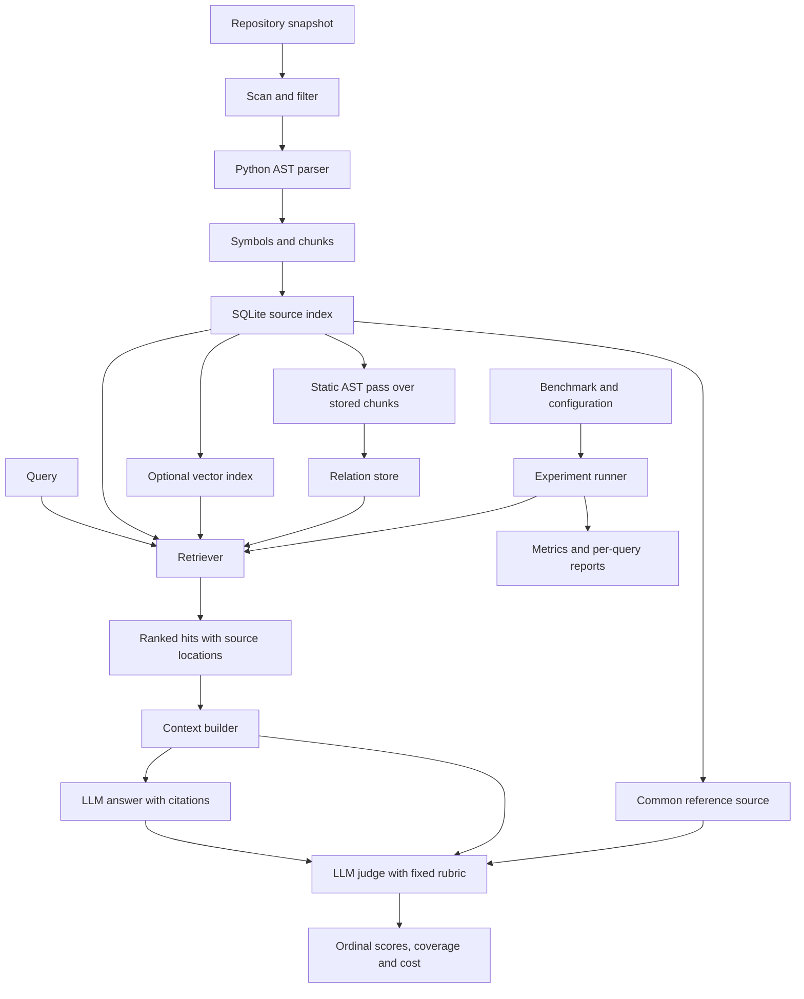

# Architecture

## Purpose and scope

Investigate when repository structure improves retrieval quality and whether the
improvement justifies indexing, retrieval, and context costs. Improvement is a
hypothesis to test, not an assumption.

The first implementation targets Python 3.12 syntax, local snapshots, and one
repository per query. Read source statically without importing or running it.
Report syntax errors and unsupported files. Code editing, agent execution loops,
distributed services, and model training are outside the initial scope.

The flow below describes the implemented pipeline: scanning, AST extraction, chunks,
SQLite persistence, five retrieval strategies, vector/graph artifacts, evaluation
and bounded QA. The first live QA/LLM-scoring experiment is archived; M7c adds an
offline judge-protocol revision and M7d adds judge-only execution. The subsequent
approved v2 run is archived as partial: 12 valid judgments, one unknown attempted
outcome and 47 requests not started after interruption. M7e's separate live follow-up
has now attempted those 47 requests, yielding 46 valid judgments and one protocol
failure. Cumulative score coverage is 58/60 with one invalid judgment and one
historical unknown. Engineering delivery is complete; coverage and provisional-label
limits remain explicit. Human review is optional. See [acceptance status](status.md).

## Data flow

## Modules and data contracts

| Module | Responsibility |
| --- | --- |
| `ingestion` | File selection, exclusions, snapshot identity, diagnostics |
| `parsing` | AST extraction, source ranges and structural chunks |
| `indexing` | Persist source metadata, symbols, chunks and lexical tokens in SQLite |
| `embeddings` / `relations` | Snapshot-bound NPZ vectors and JSON relation graphs |
| `retrieval` / `strategies` / `structure` | BM25, shared interface, baseline fusion and bounded graph reranking |
| `qa.context` | Deduplicate and pack evidence under an exact UTF-8 byte budget |
| `qa` | Model adapter, evidence-grounded prompts, citations |
| `qa.assessment_plan` / `qa.assessment_execution` | Freeze both stages, shared references and costs; validate approval and journal execution |
| `qa.judging` / `qa.assessment_reporting` | Validate source-bound LLM judgments; report ordinal dimensions, coverage and separate stage costs |
| `qa.judgment_schema` | Build v2 per-answer response catalogs and strict schemas from actual claim and evidence IDs |
| `qa.judge_reporting` | Report new judge-only outcomes and costs separately from preserved generation measurements |
| `evaluation` | Dataset validation, experiments, metrics, reports |

Keep the CLI thin and library logic independent of the user interface. Shared data
contracts carry these identities and provenance:

- **Snapshot:** repository identity, commit when available, content manifest/hash,
  selection rules, parser/schema versions. A commit alone cannot identify dirty code.
- **Symbol:** file/module, class, function, or method with qualified name and source
  range. Public line numbers are one-based and inclusive.
- **Chunk:** searchable text associated with a symbol and exact source range. Long
  symbols may yield multiple chunks; module-level code also needs coverage.
- **Relation:** typed directed edge, endpoints, extraction evidence, and confidence
  category distinguishing resolved facts from heuristics.
- **SearchResult:** chunk ID, rank, score components, source location, and provenance
  such as direct retrieval or relation expansion.

IDs must be deterministic for identical snapshots and configuration. Evaluate chunks
through their source/symbol identities. Source or parser changes may invalidate IDs
and caches. Separating symbols from chunks prevents duplicate relevance credit.

## Retrieval strategies

1. **BM25:** identifier-aware tokenization over canonical chunk text.
2. **Dense:** a fixed embedding model over the same canonical content.
3. **Hybrid:** reciprocal rank fusion of BM25 and dense rankings.
4. **Symbol-aware:** hybrid plus name, qualified-name, signature, and path features.
5. **Structure-aware:** Hybrid seeds by default (BM25/Symbol are configurable), bounded one-hop expansion, and reranking
   by relation type and seed support.

Keep complete identifiers alongside snake_case/camelCase components. Preserve source
text separately from preprocessing. Record embedding prompts and truncation rules.

Relations cover containment, supported internal imports, statically resolvable
calls and test/source associations. AST nodes do not provide a complete call graph:
dynamic dispatch and runtime imports require conservative handling. Preserve
unresolved targets explicitly instead of inventing edges.

Expansion requires per-seed and total candidate limits, deduplication, and score
provenance. High-degree modules must not dominate merely by size. Evaluate structural
chunking separately from graph features.

## Technology choices

| Concern | Current implementation |
| --- | --- |
| Runtime/environment | Python 3.12, uv lockfile, `src/` layout, type annotations |
| CLI | Typer |
| Parsing | Standard-library `ast` plus original source text |
| Source metadata / relations | SQLite source index / separate JSON graph; no database service |
| Lexical retrieval | `rank-bm25` with project-controlled tokenization |
| Embeddings | Optional Sentence Transformers; pinned all-MiniLM-L6-v2 on CPU |
| Vector search | NumPy exact search; consider ANN only after measurement |
| Quality | pytest, pytest-cov, Ruff, Windows/Linux GitHub Actions |
| Delivery | CLI, static reports, base/CPU-Dense Docker targets and offline smoke |

`pathspec` handles nested ignore rules; `rank-bm25` (with NumPy) handles lexical
search. Model dependencies are optional. No external database service, web service,
or orchestration framework is required.

## M2 implementation details

Current components are single modules named after their responsibilities. Split a
module into a package only when additional implementations justify it.

- `scan_repository` yields sorted source files, raw byte hashes, applied ignore-file
  hashes, skipped-file diagnostics, and counts of excluded entries. Excluded
  directories are counted as entries, not recursively counted files.
- `parse_file` decodes Python encoding cookies and normalizes CRLF/CR to LF. It keeps
  decorators in definition ranges and assigns each source line to its deepest
  definition. Parent chunks retain the remaining lines; whitespace-only chunks are
  omitted. Long spans are split at a configurable line count without overlap.
- Names are **path-qualified** lexical names. For example, `src/requests/api.py`
  produces `src.requests.api`, without inferring runtime `sys.path` or import roots.
- `build_index` writes metadata, files, symbols, chunks/tokens, and import references
  to a temporary SQLite database, then replaces the destination atomically. Failed
  writes preserve the previous snapshot. Rebuild is explicit, not incremental.
- `load_index` validates the application/schema/tokenizer identifiers and loads
  JSON records, without source access or pickle deserialization.
- `BM25Retriever.from_path` reconstructs corpus statistics once; reuse the instance
  for repeated queries. Ranking currently scores all chunks in memory.

The snapshot fingerprint hashes source-byte manifests, selection/chunk/tokenizer
configuration, ignore-file hashes, and skipped-file identities/reasons. Paths to
the local checkout and timestamps are excluded. Identical source bytes and config
produce identical IDs across checkout locations; different checkout line endings
can change hashes. Git commit/dirty state and runtime versions are recorded as
provenance, not substitutes for the captured source manifest.

The explicit baseline variant is `BM25Plus(k1=1.5, b=0.75, delta=0)`, using positive
IDF `log((N+1)/df)`. Delta zero ensures nonmatches score zero even when some query
terms occur elsewhere. Code/path/name/signature share one text field; this is not
the later symbol-aware reranking strategy. Keep this baseline and parameters fixed
when introducing subsequent methods.

## M3 evaluation boundary

The `evaluation/` package separates strict dataset/config loaders, pure ranking
metrics, opt-in source preparation, the runner, and report serialization. Preparation
may download Git sources; evaluation only reads already-built indexes. CLI commands
delegate to these library functions.

Source locators and corpus fingerprints decouple labels from chunking. The runner
considers all matching chunks, aggregates unique symbols or files, and computes the
same metrics for every configured cutoff. All five retrievers preserve this
comparison contract through the shared factory.

Run metadata binds quality results to labels, source bytes, parser/index settings,
code/dependency versions, and machine context. Rankings and per-query metrics are
retained rather than publishing only aggregate scores. Reports identify provisional
labels and unjudged candidates. Optional human review remains distinct from successful
schema/source-location validation and is not an acceptance prerequisite.

## M4 retrieval boundary

`strategies.Retriever` defines `index` and `search(query, top_k=...)`; the original
`BM25Retriever` satisfies it without loading model dependencies. The factory dispatches
BM25, exact dense, two-branch RRF hybrid, and three-branch symbol-aware RRF. Each returns
the same source objects; new strategies add score components for auditability.

`embeddings.py` keeps model setup separate from retrieval. One `SentenceEncoder` is
reused across repositories in an experiment. Offline chunk encoding writes a compressed
NPZ array plus JSON metadata, bound to snapshot ID, ordered chunk IDs, canonical text,
model revision and encoder package versions. Loading forbids pickle arrays and validates
shape, finite unit vectors and checksum. No vector database or ANN index is introduced.

The experiment runner injects the encoder/vector files into the factory, preserves
M3's deduplication and label rules, and records model startup plus per-repository vector
costs. Query encoding and fusion are timed on every repetition; query embeddings are
not cached. `compare` checks recorded-run compatibility and emits paired per-query
quality changes. It does not infer statistical significance or relabel candidates.

See [baseline definitions](baselines.md) for constants, truncation and limitations.
The symbol heuristic regresses on several questions. Frozen experiments compare
seed choices and relation ablations; see [measured findings](../RESULTS.md).

## M5 graph boundary

`relations.py` reconstructs line-aligned source from persisted chunks and performs a
second static AST pass. Scope bindings resolve a restricted subset of imports/calls;
no source is imported or executed. Typed edges and unresolved references are published
as a separate JSON artifact bound to snapshot, symbols, chunks and resolver version.
This preserves M2–M4 index/vector compatibility and keeps graph extraction independently
testable. Test-to-source calls form a disjoint edge category for meaningful ablations.

`structure.py` wraps the shared retriever interface. It takes unique seed symbols,
examines a bounded prefix of typed adjacency lists in both directions, and boosts
only the best existing evidence chunk of each selected non-seed neighbor. One-hop
depth, caps, relation weights and maximum support prevent recursive or unbounded
propagation. This is a heuristic reranker over full baseline results, not graph-only
candidate retrieval or a scalability improvement. Each boost records its seed and edge.

The runner adds graph provenance, observed graph work and per-K returned context size.
Cost accounting is outside the retrieval timer. Context uses one stored evidence
chunk per returned unit; lexical token counts are not model billing tokens. Optional
experiment names allow `compare` to distinguish multiple structure configurations.
See [the resolver, scoring policy and limits](structure.md).

## M6a analysis and review boundary

`evaluation/recorded.py` checks saved run identities, quality fingerprints and summary
quality before reuse. `uncertainty.py` computes paired means and seeded repository
cluster intervals without executing retrieval. `comparison.py` records both analysis
and original retrieval provenance. Uncertainty does not imply label completeness.

`evaluation/review.py` builds symbol pools from recorded rankings, every existing qrel
and validated indexes. It creates frozen provenance/source artifacts and separate
editable decision templates. Review checking archives decisions and flags conflicts;
it does not mutate benchmark labels or grant human-review status. This keeps annotation
changes separate from retrieval and prevents accidental rewriting of old experiments.

## Storage and references

`evaluation/overview.py` consolidates saved experiment evidence after checking the
frozen plan, complete strategy matrix, dataset/snapshot bindings and quality
fingerprints. `scripts/summarize_results.py --check` detects stale generated JSON
and Markdown in CI without source checkouts, model weights or API access. Recorded
timings remain separate from quality validation. This adds presentation and audit
coverage, without changing retrieval algorithms or old experiment artifacts.

M8a's multi-stage Docker build uses the existing lockfile, an immutable package
installation and a non-root runtime. The optional Dense target adds CPU dependencies;
model weights and repository snapshots remain explicitly prepared runtime artifacts.
`scripts/smoke.py` exercises installed CLI processes on an isolated source fixture,
including repeated evaluation and pending review creation. CI runs both targets with
networking disabled after building. See [container boundaries and reproduction](docker.md).

M7a's `qa/context.py` packs canonical stored chunks, preserving complete source lines,
one chunk per symbol, nonoverlapping ranges and a fingerprint. Its byte budget includes
serialized evidence metadata, but excludes the system prompt and provider framing.
`qa/answering.py` keeps evidence as data, validates structured claims and citation IDs,
and renders source excerpts. No tool execution or agent loop is involved.

`qa/citations.py` shares deterministic packed-evidence checks across single-question
completion and frozen-bundle validation: portable paths, source identities, hashes
and physical line ranges. Source ownership is bound to the canonical index during
packing. Single-generation artifacts separate `automatic_checks` from `llm_assessment`,
whose `not_run` placeholder remains a snapshot of that generation stage. Combined
assessment records store the actual separate outcome in `row.judging`; they do not
rewrite the generation object. The [fixed scoring contract](llm-evaluation.md) is
implemented by M7b's judge; the [live record](../reports/m7b-live/README.md) separates
accepted experimental scores from judge protocol failures and missing dimensions.

`qa/provider.py` sends one strict-schema OpenAI Responses request, only when explicitly
invoked. It stores reported usage and identifiers without credentials and never retries.
`qa/preparation.py` freezes requests from existing retrieval configs, excluding reference
answers; `qa/execution.py` verifies the bundle and records each attempted/completed request.
`qa/assessment_plan.py` binds exact generation inputs, common canonical reference
chunks, rubric, model settings and combined cost to one approved fingerprint.
`qa/assessment_execution.py` records attempts before calls and outputs after them,
preserves every planned case, and stops on provider errors without retries/resume.
`qa/judging.py` separates packed evidence from judge-only references and validates
ordinal statuses, citations and answer/context bindings. `qa/assessment_reporting.py`
keeps conditional means, paired scored cases, missing outcomes, stage costs and
timing boundaries explicit. Preparation and validation make no API calls.

M7c's `scripts/prepare_qa_judge_revision.py` verifies an existing assessment archive,
then prepares v2 judge requests using the exact saved answers, packed context and
common references. `qa/judgment_schema.py` exposes legal status/score combinations,
full source-ID enums and claim bounds; `qa/judging.py` recomputes those schemas when
checking bindings. Duplicate IDs, selected-claim citation support and reference-status
coupling still require host checks. Valid schema output does not establish semantic truth.
The bundle freezes messages, per-answer schemas, provenance and an offline cost proposal.
Its archived-output replay changes only the rubric identifier in diagnostic copies;
v1 results remain immutable. The combined assessment runner continues to accept only
v1. See [M7c evidence](../reports/m7c/README.md).

M7d's `scripts/run_qa_judge_revision.py` executes a checked M7c bundle only after
explicit model, plan, budget and execution consent. It copies the frozen bundle,
reuses source generations verbatim and journals only the new v2 judge calls. All
source cases remain in the records; ineligible generations are skipped, while
invalid judge responses remain visible and do not stop subsequent requests.
Provider errors stop execution. Fresh output paths, no retries and no resume keep
the approved scope bounded. `scripts/verify_qa_judge_revision.py` checks saved inputs,
journals, results and recomputed summaries without credentials or model calls.
Unknown attempted outcomes retain unknown usage and cost. The [M7d checkpoint](../reports/m7d/README.md)
validates this behavior with test doubles; it measures no new model performance.
Unexpected exceptions now trigger a best-effort `interruption.json` containing
execution phase, counts, exception type, numeric OS codes and traceback locations,
without exception text, source lines or local variables. Diagnostics do not replace
the original exception, recover a missing response or authorize another request.
The later [partial live archive](../reports/m7d-live/README.md) contains 13 attempts
and 12 recorded results after a local execution interruption whose cause was not
preserved. Its missing response remains unknown, and the 47 unstarted requests
remain in the planned denominator. Offline verification neither recovers the
missing provider outcome nor triggers a retry. The prefix of known judgments does
not establish a completed strategy comparison.

M7e's `scripts/prepare_qa_judge_followup.py` independently verifies and freezes an
original partial revision run, selecting only requests absent from its attempt
journal. Selected v2 payloads, model, references and rubric stay unchanged. The
runner and verifier require explicit `--followup` mode for this distinct bundle,
with a new plan fingerprint, approval and output directory. This first version
rejects running/completed parents, empty remaining scopes and nested follow-ups.
New journals cover only the selected batch; records retain all source rows and
prior judgments. Reports separate historical, new and cumulative measurements.
The original unknown outcome remains excluded from new requests and keeps full
cumulative cost unknown. The [M7e checkpoint](../reports/m7e/README.md) records offline
implementation and preparation. Its separately approved
[live follow-up](../reports/m7e-live/README.md) records 47 attempts and 47 outcomes,
including 46 valid judgments and one protocol failure. It makes no new generation
calls and does not retry the historical unknown. The batch is `complete_with_failures`;
cumulative status remains `incomplete` with 58 valid judgments, one invalid judgment
and one historical unknown. Saved-run verification checks both batches without
executing either, and cannot establish semantic correctness or recover unknown cost.

`qa/review.py` validates optional human judgments and gates only its own manual
aggregates on complete submissions. It does not gate project acceptance.
Model scores remain separately labeled and do not promote provisional labels.
See [the QA protocol](qa.md) for failure, generation-only cost and M7b combined-budget
boundaries.

M6c's `evaluation/experiments.py` freezes the inherited configuration matrix and
coordinates separate dev/test/public runs. `evaluation/profiling.py` launches one
fresh Python worker per index/graph/vector build or experiment. It records OS memory
high-water marks, operation and worker wall times, artifacts and failure logs without
adding a service or dependency. Existing loaders, runner and comparison logic remain
the source of retrieval/metric behavior. Provisional-label opt-in is explicit;
experiment completion does not grant human-review status.

M6b's `evaluation/curation.py` resolves explicit draft targets and imports a pinned
RepoQA subset into the existing benchmark schema. It records source/provenance hashes
and always publishes provisional labels. Public mapping checks UTF-8 byte offsets,
zero-based upstream lines and decorator-inclusive local targets against AST nodes.
`evaluation/suite.py` validates frozen members and source isolation without loading a
retriever. Label-only review reuses M6a's source bundle format with an empty run list
and a distinct policy. Exact-commit source preparation shallow-fetches only new
checkouts. Existing retrieval/index/model formats remain compatible.

Commit small fixtures, reviewed labels, manifests, configs, and selected reports.
Store downloaded snapshots/models and indexes under ignored `artifacts/`; record
checksums and effective configurations alongside runs. Do not commit credentials.

- [Python AST](https://docs.python.org/3.12/library/ast.html)
- [rank-bm25](https://github.com/dorianbrown/rank_bm25)
- [Sentence Transformers usage](https://www.sbert.net/docs/sentence_transformer/usage/usage.html)
