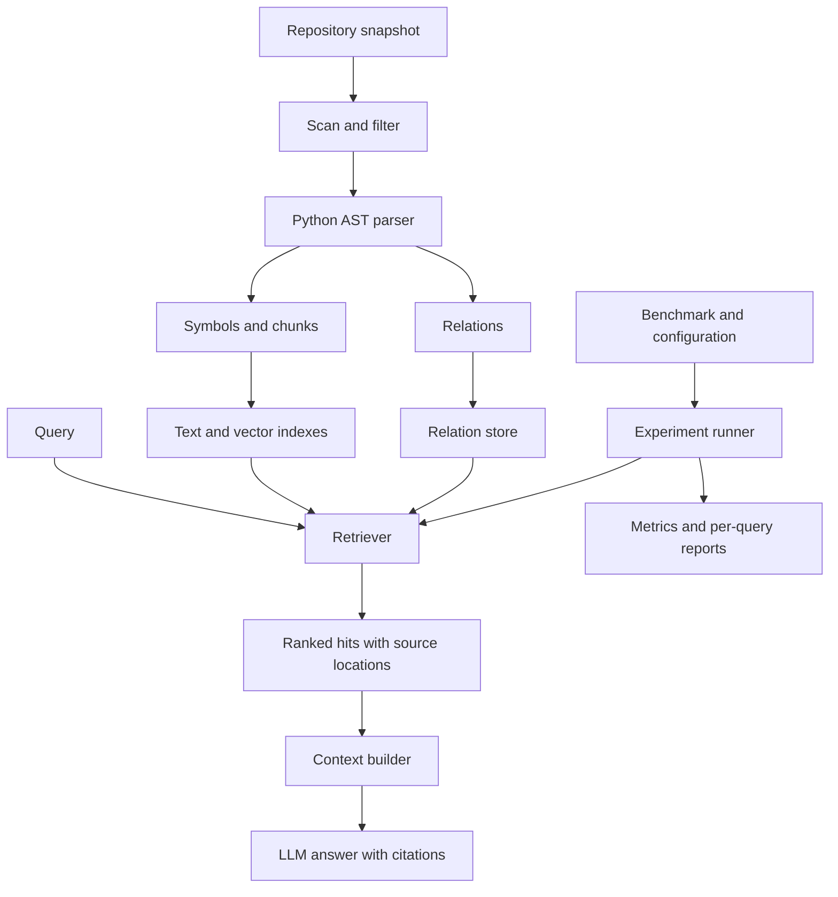

# Architecture

## Purpose and scope

Investigate when repository structure improves retrieval quality and whether the
improvement justifies indexing, retrieval, and context costs. Improvement is a
hypothesis to test, not an assumption.

The first implementation targets Python 3.12 syntax, local snapshots, and one
repository per query. Read source statically without importing or running it.
Report syntax errors and unsupported files. Code editing, agent execution loops,
distributed services, and model training are outside the initial scope.

This is the target design. M1 implements only the package, CLI information entry
points, checks, and documentation.

## Data flow

## Modules and data contracts

| Module | Responsibility |
| --- | --- |
| `ingestion` | File selection, exclusions, snapshot identity, diagnostics |
| `parsing` | AST extraction, source ranges, chunks, conservative relation resolution |
| `indexing` | Persist metadata, searchable text, vectors, and relations |
| `retrieval` | Strategies returning a shared result schema |
| `context` | Deduplicate and pack evidence under a token budget |
| `qa` | Model adapter, evidence-grounded prompts, citations |
| `evaluation` | Dataset validation, experiments, metrics, reports |

Introduce modules as working features arrive. Keep the CLI thin and library logic
independent of the user interface. Proposed data objects:

- **Snapshot:** repository identity, commit when available, content manifest/hash,
  selection rules, parser/schema versions. A commit alone cannot identify dirty code.
- **Symbol:** file/module, class, function, or method with qualified name and source
  range. Public line numbers are one-based and inclusive.
- **Chunk:** searchable text associated with a symbol and exact source range. Long
  symbols may yield multiple chunks; module-level code also needs coverage.
- **Relation:** typed directed edge, endpoints, extraction evidence, and confidence
  category distinguishing resolved facts from heuristics.
- **SearchResult:** chunk ID, rank, score components, source location, and provenance
  such as direct retrieval or relation expansion.

IDs must be deterministic for identical snapshots and configuration. Evaluate chunks
through their source/symbol identities. Source or parser changes may invalidate IDs
and caches. Separating symbols from chunks prevents duplicate relevance credit.

## Retrieval strategies

1. **BM25:** identifier-aware tokenization over canonical chunk text.
2. **Dense:** a fixed embedding model over the same canonical content.
3. **Hybrid:** reciprocal rank fusion of BM25 and dense rankings.
4. **Symbol-aware:** hybrid plus name, qualified-name, signature, and path features.
5. **Structure-aware:** symbol-aware seeds, bounded one-hop expansion, and reranking
   by relation type and seed support.

Keep complete identifiers alongside snake_case/camelCase components. Preserve source
text separately from preprocessing. Record embedding prompts and truncation rules.

Start relations with containment and internal imports, then statically resolvable
calls and test/source associations. AST nodes do not provide a complete call graph:
dynamic dispatch and runtime imports require conservative handling. Preserve
unresolved targets explicitly instead of inventing edges.

Expansion requires per-seed and total candidate limits, deduplication, and score
provenance. High-degree modules must not dominate merely by size. Evaluate structural
chunking separately from graph features.

## Technology choices

| Concern | Initial choice |
| --- | --- |
| Runtime/environment | Python 3.12, uv lockfile, `src/` layout, type annotations |
| CLI | Typer |
| Parsing | Standard-library `ast` plus original source text |
| Metadata/relations | SQLite; no database service |
| Lexical retrieval | `rank-bm25` with project-controlled tokenization |
| Embeddings | Sentence Transformers; choose and pin a model in M4 |
| Vector search | NumPy exact search; consider ANN only after measurement |
| Quality | pytest, pytest-cov, Ruff, Windows/Linux GitHub Actions |
| Delivery | CLI and static reports first; Docker in M8 |

Only Typer and development tools are installed in M1. Add model and retrieval
dependencies with their features. No external vector/graph database, web service,
or orchestration framework is currently justified.

## Storage and references

Commit small fixtures, reviewed labels, manifests, configs, and selected reports.
Store downloaded snapshots/models and indexes under ignored `artifacts/`; record
checksums and effective configurations alongside runs. Do not commit credentials.

- [Python AST](https://docs.python.org/3.12/library/ast.html)
- [rank-bm25](https://github.com/dorianbrown/rank_bm25)
- [Sentence Transformers usage](https://www.sbert.net/docs/sentence_transformer/usage/usage.html)
