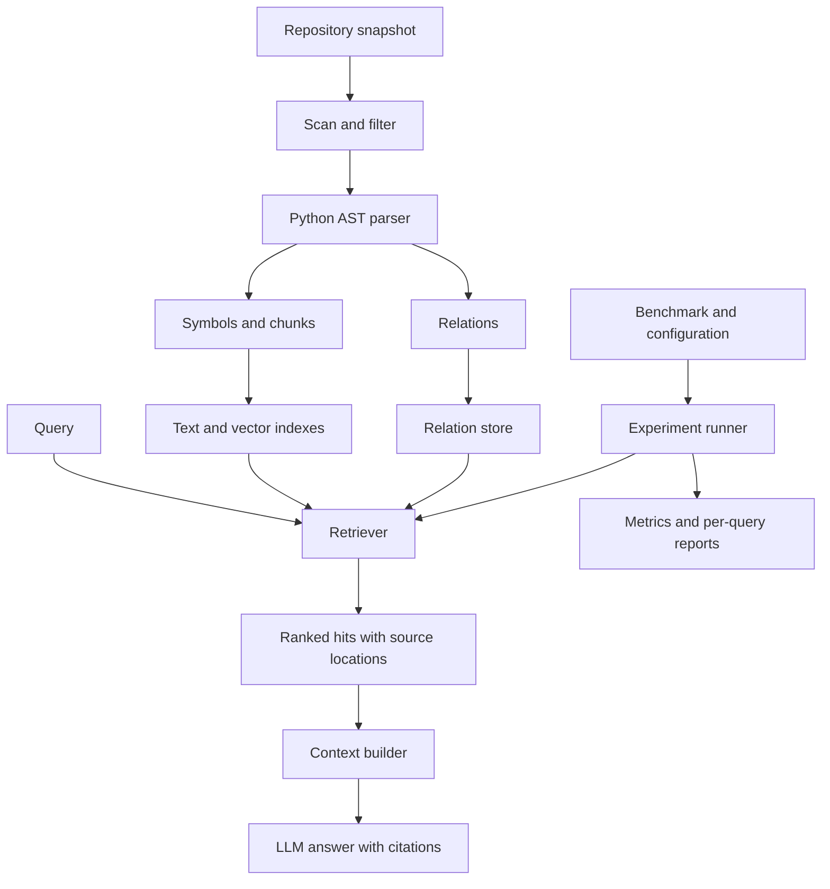

# Architecture

## Purpose and scope

Investigate when repository structure improves retrieval quality and whether the
improvement justifies indexing, retrieval, and context costs. Improvement is a
hypothesis to test, not an assumption.

The first implementation targets Python 3.12 syntax, local snapshots, and one
repository per query. Read source statically without importing or running it.
Report syntax errors and unsupported files. Code editing, agent execution loops,
distributed services, and model training are outside the initial scope.

The flow below is the target design. M3 includes scanning, AST extraction, chunks,
SQLite persistence, BM25 search, and the evaluation runner. Graph retrieval, dense
embeddings and QA remain planned.

## Data flow

## Modules and data contracts

| Module | Responsibility |
| --- | --- |
| `ingestion` | File selection, exclusions, snapshot identity, diagnostics |
| `parsing` | AST extraction, source ranges, chunks, conservative relation resolution |
| `indexing` | Persist metadata, searchable text, vectors, and relations |
| `retrieval` | Strategies returning a shared result schema |
| `context` | Deduplicate and pack evidence under a token budget |
| `qa` | Model adapter, evidence-grounded prompts, citations |
| `evaluation` | Dataset validation, experiments, metrics, reports |

Introduce modules as working features arrive. Keep the CLI thin and library logic
independent of the user interface. Proposed data objects:

- **Snapshot:** repository identity, commit when available, content manifest/hash,
  selection rules, parser/schema versions. A commit alone cannot identify dirty code.
- **Symbol:** file/module, class, function, or method with qualified name and source
  range. Public line numbers are one-based and inclusive.
- **Chunk:** searchable text associated with a symbol and exact source range. Long
  symbols may yield multiple chunks; module-level code also needs coverage.
- **Relation:** typed directed edge, endpoints, extraction evidence, and confidence
  category distinguishing resolved facts from heuristics.
- **SearchResult:** chunk ID, rank, score components, source location, and provenance
  such as direct retrieval or relation expansion.

IDs must be deterministic for identical snapshots and configuration. Evaluate chunks
through their source/symbol identities. Source or parser changes may invalidate IDs
and caches. Separating symbols from chunks prevents duplicate relevance credit.

## Retrieval strategies

1. **BM25:** identifier-aware tokenization over canonical chunk text.
2. **Dense:** a fixed embedding model over the same canonical content.
3. **Hybrid:** reciprocal rank fusion of BM25 and dense rankings.
4. **Symbol-aware:** hybrid plus name, qualified-name, signature, and path features.
5. **Structure-aware:** symbol-aware seeds, bounded one-hop expansion, and reranking
   by relation type and seed support.

Keep complete identifiers alongside snake_case/camelCase components. Preserve source
text separately from preprocessing. Record embedding prompts and truncation rules.

Start relations with containment and internal imports, then statically resolvable
calls and test/source associations. AST nodes do not provide a complete call graph:
dynamic dispatch and runtime imports require conservative handling. Preserve
unresolved targets explicitly instead of inventing edges.

Expansion requires per-seed and total candidate limits, deduplication, and score
provenance. High-degree modules must not dominate merely by size. Evaluate structural
chunking separately from graph features.

## Technology choices

| Concern | Initial choice |
| --- | --- |
| Runtime/environment | Python 3.12, uv lockfile, `src/` layout, type annotations |
| CLI | Typer |
| Parsing | Standard-library `ast` plus original source text |
| Metadata/relations | SQLite; no database service |
| Lexical retrieval | `rank-bm25` with project-controlled tokenization |
| Embeddings | Sentence Transformers; choose and pin a model in M4 |
| Vector search | NumPy exact search; consider ANN only after measurement |
| Quality | pytest, pytest-cov, Ruff, Windows/Linux GitHub Actions |
| Delivery | CLI and static reports first; Docker in M8 |

M2 adds `pathspec` for nested ignore rules and `rank-bm25` (with NumPy) for lexical
search. Model dependencies arrive with their features. No external database service,
web service, or orchestration framework is currently justified.

## M2 implementation details

Current components are single modules named after their responsibilities. Split a
module into a package only when additional implementations justify it.

- `scan_repository` yields sorted source files, raw byte hashes, applied ignore-file
  hashes, skipped-file diagnostics, and counts of excluded entries. Excluded
  directories are counted as entries, not recursively counted files.
- `parse_file` decodes Python encoding cookies and normalizes CRLF/CR to LF. It keeps
  decorators in definition ranges and assigns each source line to its deepest
  definition. Parent chunks retain the remaining lines; whitespace-only chunks are
  omitted. Long spans are split at a configurable line count without overlap.
- Names are **path-qualified** lexical names. For example, `src/requests/api.py`
  produces `src.requests.api`, without inferring runtime `sys.path` or import roots.
- `build_index` writes metadata, files, symbols, chunks/tokens, and import references
  to a temporary SQLite database, then replaces the destination atomically. Failed
  writes preserve the previous snapshot. Rebuild is explicit, not incremental.
- `load_index` validates the application/schema/tokenizer identifiers and loads
  JSON records, without source access or pickle deserialization.
- `BM25Retriever.from_path` reconstructs corpus statistics once; reuse the instance
  for repeated queries. Ranking currently scores all chunks in memory.

The snapshot fingerprint hashes source-byte manifests, selection/chunk/tokenizer
configuration, ignore-file hashes, and skipped-file identities/reasons. Paths to
the local checkout and timestamps are excluded. Identical source bytes and config
produce identical IDs across checkout locations; different checkout line endings
can change hashes. Git commit/dirty state and runtime versions are recorded as
provenance, not substitutes for the captured source manifest.

The explicit baseline variant is `BM25Plus(k1=1.5, b=0.75, delta=0)`, using positive
IDF `log((N+1)/df)`. Delta zero ensures nonmatches score zero even when some query
terms occur elsewhere. Code/path/name/signature share one text field; this is not
the later symbol-aware reranking strategy. Keep this baseline and parameters fixed
when introducing subsequent methods.

## M3 evaluation boundary

The `evaluation/` package separates strict dataset/config loaders, pure ranking
metrics, opt-in source preparation, the runner, and report serialization. Preparation
may download Git sources; evaluation only reads already-built indexes. CLI commands
delegate to these library functions.

Source locators and corpus fingerprints decouple labels from chunking. The runner
considers all matching chunks, aggregates unique symbols or files, and computes the
same metrics for every configured cutoff. Only BM25 is dispatched in M3; later
retrievers must preserve this comparison contract.

Run metadata binds quality results to labels, source bytes, parser/index settings,
code/dependency versions, and machine context. Rankings and per-query metrics are
retained rather than publishing only aggregate scores. Reports identify provisional
labels and unjudged candidates. The human-review acceptance item is deliberately
distinct from successful schema/source-location validation.

## Storage and references

Commit small fixtures, reviewed labels, manifests, configs, and selected reports.
Store downloaded snapshots/models and indexes under ignored `artifacts/`; record
checksums and effective configurations alongside runs. Do not commit credentials.

- [Python AST](https://docs.python.org/3.12/library/ast.html)
- [rank-bm25](https://github.com/dorianbrown/rank_bm25)
- [Sentence Transformers usage](https://www.sbert.net/docs/sentence_transformer/usage/usage.html)
